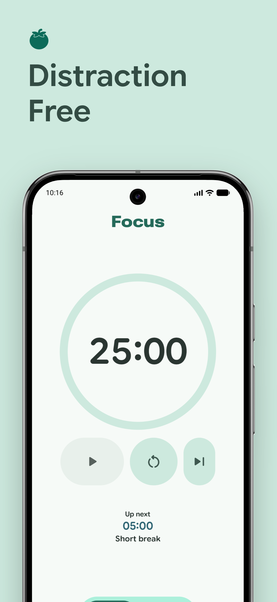
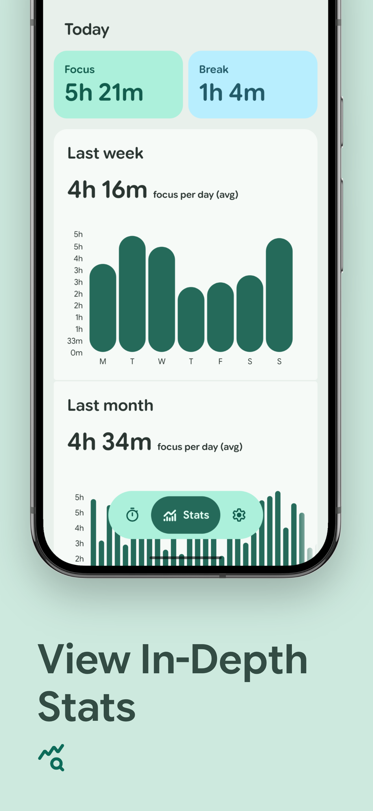
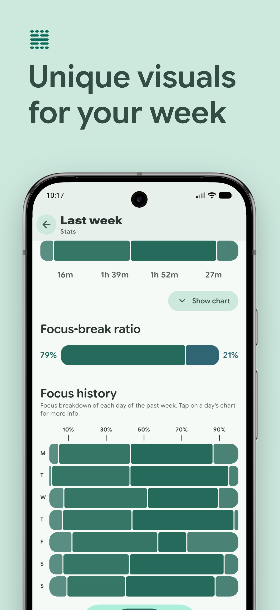
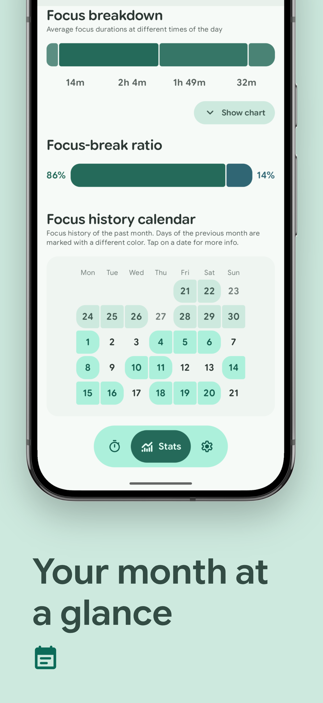

# Tomato (Personal Build) 🍅

A minimalist Pomodoro timer, tweaked and perfected for my own personal workflow.

This is a custom fork of the beautiful [Tomato app by nsh07](https://github.com/nsh07/Tomato).

---

### 🛠️ What's different in this build?

- **Fully Unlocked**: All premium "Tomato+" features are permanently unlocked out of the box.
- **Accurate Statistics**: Rewrote the average focus time calculation to correctly measure averages across the entire calendar window (not just active days), giving me honest stats.
- **Cloud Backups**: Rebuilt the backup flow to use modern Android intents. I can now seamlessly save database backups locally or push them straight to my Google Drive.
- **Side-by-Side Install**: Uses a custom Application ID (`org.nsh07.pomodoro.personal`) so I can test and use it alongside the original app without conflicts.
- **Zero Distractions**: Stripped out all the donation links, author pages, Discord banners, translation widgets, and paywall overlays. Just me and the timer.

### 📱 Screenshots

### 💻 Building

Open this project in **Android Studio** and click `Run`! It will easily compile a working APK without any tricky setup.

---
*(Original app structure and UI credits to nsh07. Material 3 Expressive base.)*
